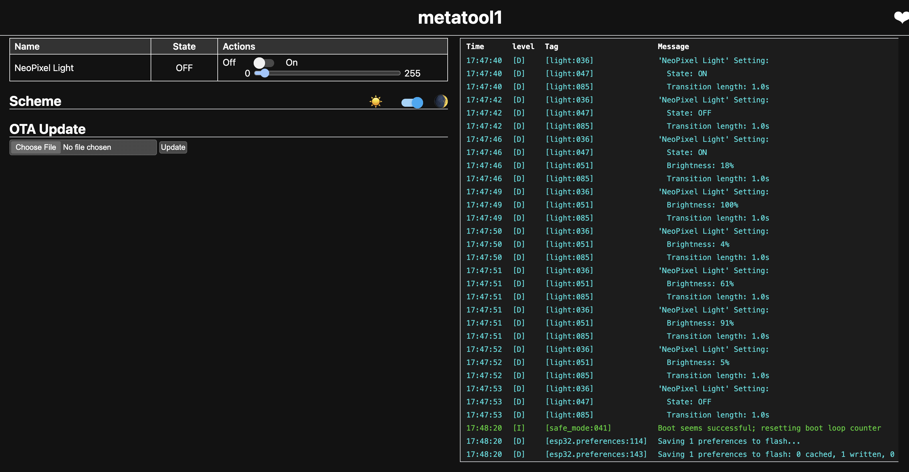

# Setup

- Install ESPHome [https://esphome.io/guides/installing_esphome]

- Download one of the CH343 drivers for this particular ESP32 board. [https://wch-ic.com/search?t=all&q=ch343]
  - (As a note, I am usually against downloading arbitrary drivers from a security perspective; I apologize in advance for choosing this board and making you download this driver! If you'd rather not download this driver, feel free to use [this board](https://www.amazon.com/ESP-WROOM-32-Development-Microcontroller-Integrated-Compatible/dp/B08D5ZD528?crid=2YL78008PMNDL&dib=eyJ2IjoiMSJ9.BIu3I9Sm5to7GVTumKqgP67op2hMtpwF80mJByziDxX1o2N4IpgFfxSJMsSMd7dIn2EgpKwLFLruBJEPyAOh-DgyIFMd1J2kFYG5a6FS3Zc-toH9UN-GYZ5m1w-BIvXsDXFzAwJgTL4UmrmAOoSKp6TNDcljUfx9421YtJtXivtooZwd2_8AGKucUXF_nuaSUbPF1-WJwM6KDPfLbYw6kyrClBKAYd8X0A4HbOHtDpA.PpQPr9olL2c063G_s9xqqz2vYNY4dyR0vtzTliF-5J4&dib_tag=se&keywords=esp32&qid=1727299280&sprefix=esp32,aps,134&sr=8-2).)

# Create an ESPHome project!

Open a terminal 
- in Mac, this is /Applications/Utilities/Terminal.app
- on the PC, You can do this by opening the Start menu, type Windows PowerShell, select Windows PowerShell, then select Open.

In terminal, 
- type `esphome wizard metatool1.yaml`. A wizard should appear!
- Give your ESPHome a name. e.g. 'dan_metatool1' or 'dan_livingroom'. 
- The platform is `esp32`.
- For the board, type in `esp32-s3-devkitc-1`.
- For wifi, type in the wifi SSID and password. We'll be able to add multiple networks later.
- Lastly, for OTA password, set a password, if you wish - I recommend just pressing enter.

It should create a `dan_metatool1.yaml` file in the directory it is currently in!

Open the file in a editor of your choice (such as Visual Studio Code).

Add in this code at the end of the YAML file:
```
web_server:
  port: 80

light:
  - platform: neopixelbus
    id: "neopixel_light"
    type: GRB
    variant: WS2812
    pin: GPIO48
    num_leds: 60
    name: "NeoPixel Light"
```
This code enables the webserver, and adds the on-board RGB LED to the configuration as a 'light' so that we can control it.


# 'Flash' and Run ESPHome file

- In terminal, type `esphome run metatool1.yaml`.

- On your first run, things might download from scratch, so this may take some time. Eventually, it will ask you for which option to upload to. Choose the one that starts with `/dev/cu.wchusb`:
  -  `  [2] /dev/cu.wchusbserial57640500571 (USB Single Serial)`
  - Enter '2'.

- The code should be 'flashed', or uploaded to the board.

# Interacting with the board

There are many different ways we'll be interacting with the board, but for now, we'll be using the built-in web server.

Go to `http://dan_metatool1.local/`, or whatever you have named your board.
You'll see something like the below: 

Try toggling the 'Off' and 'On' switch and changing the brightness. 

Do you see the LED turn on? Then success! We have successfully set up an ESP32 board!
